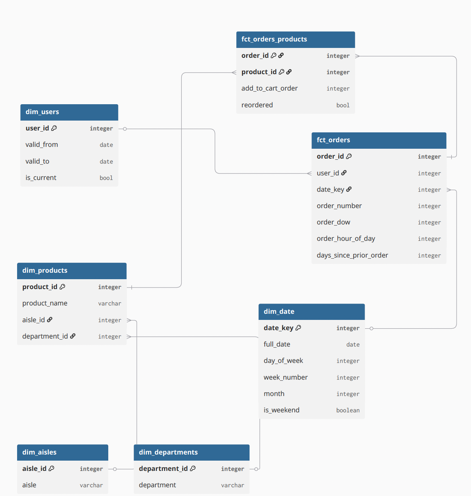

# product-analytics-platform
End-to-end product analytics stack: Instacart dataset · Snowflake · dbt · MetricFlow · Streamlit

# Product Analytics Platform

An end-to-end analytics engineering project built at the intersection of 
product analytics and analytics engineering.

## Architecture

**Dataset:** Instacart Online Grocery Shopping (3M+ orders, 200K+ users)  
**Stack:** Python ingestion → Snowflake → dbt Core → MetricFlow → Streamlit

### Data model

### dbt layer structure
- `staging/` — 1:1 with raw source tables, light cleaning only
- `intermediate/` — business logic, joins, unions
- `marts/` — final facts and dimensions, queryable by BI tools

## Metrics defined
| Metric | Definition |
|---|---|
| DAU | Distinct users placing at least one order per day |
| WAU | Distinct users placing at least one order per week |
| D7 Retention | % of users who placed another order within 7 days of first order |
| D30 Retention | % of users who placed another order within 30 days of first order |
| Reorder Rate | % of order-product rows where reordered = true |
| Avg Order Size | Average number of products per order |

## Tech stack
- **Warehouse:** Snowflake (free trial)
- **Transformation:** dbt Core 1.9
- **Metrics:** dbt MetricFlow
- **Orchestration:** Airflow (Astronomer)
- **Dashboard:** Streamlit
- **CI/CD:** GitHub Actions

## How to run locally
*Instructions will be added in Week 3 when dbt is set up.*

## Project status
🟢 Week 5 complete- Metrics defined