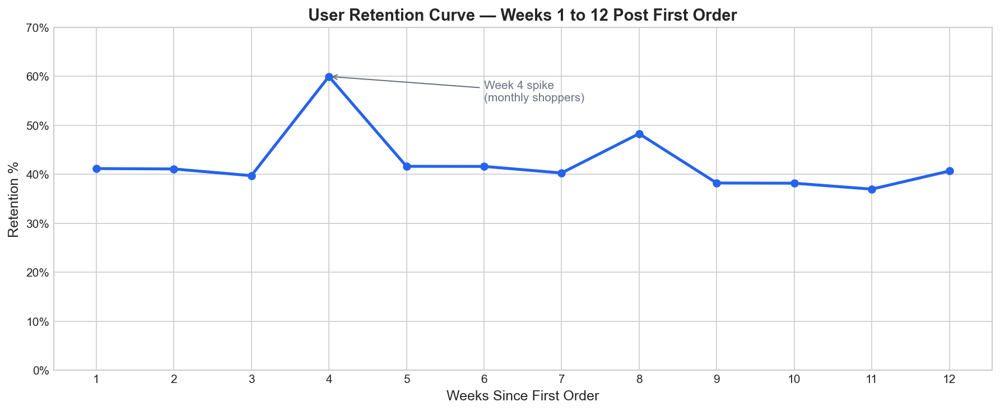
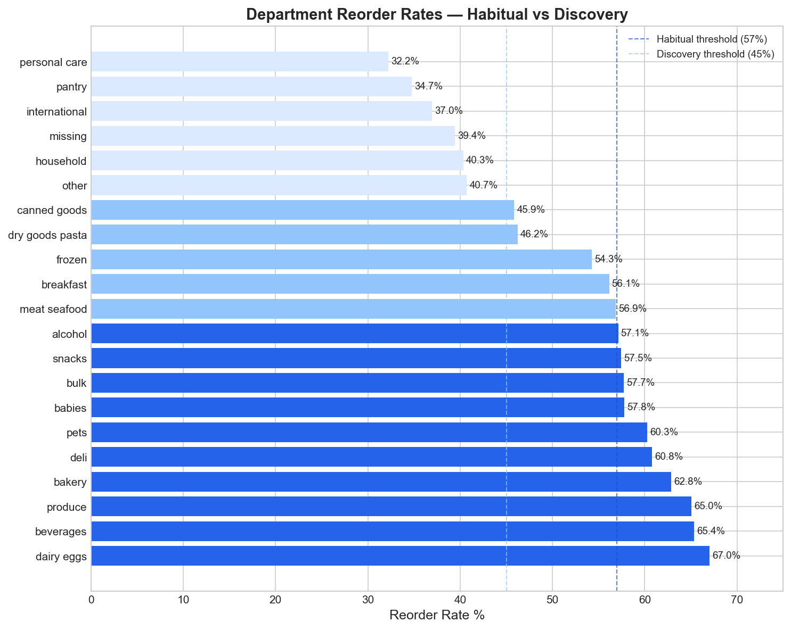
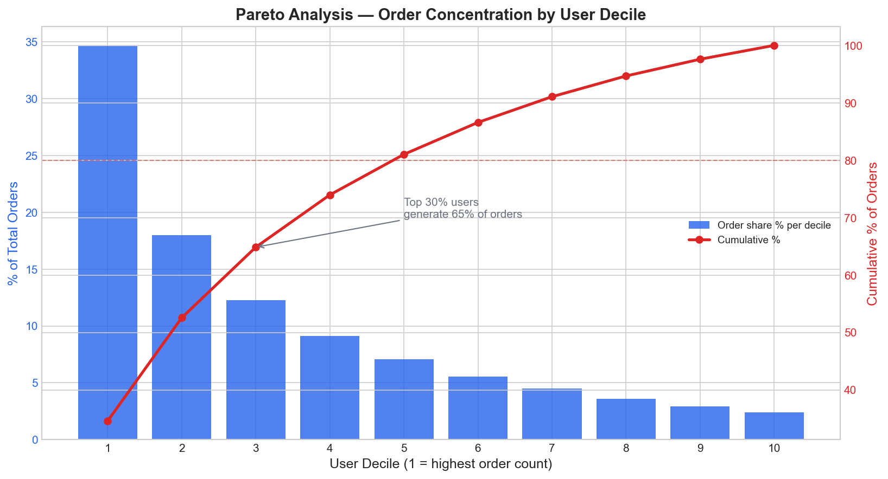
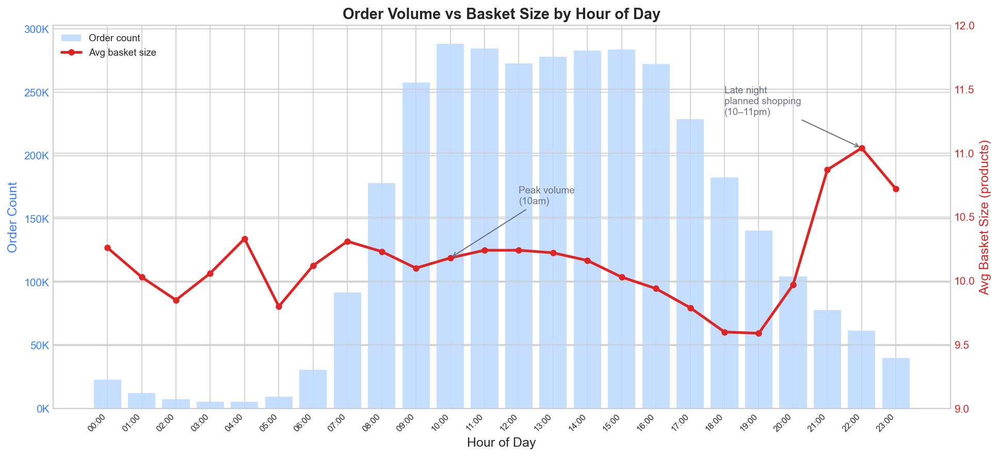
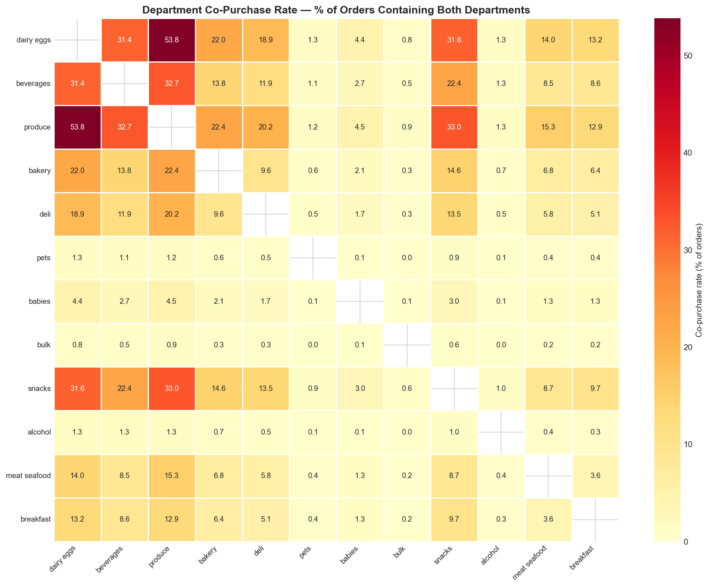

# 🛒 Product Analytics Platform

An end-to-end analytics engineering project built at the intersection of 
**product analytics** and **analytics engineering**.

## 🚀 Live Demo
**[View the Streamlit Dashboard](https://instacartanalytics.streamlit.app/)**  
**[View the dbt Docs](https://nithinpradeep38.github.io/product-analytics-platform/)**


## 🧰 Tech Stack

- **Data Warehouse:** Snowflake  
- **Transformation:** dbt Core (3-layer architecture: staging → intermediate → marts)  
- **Semantic Layer / Metrics:** MetricFlow (dbt Semantic Layer)  
- **Orchestration:** Airflow  
- **Analytics Engineering:** Python (pandas)  
- **Dashboarding:** Streamlit  
- **CI/CD:** GitHub Actions  
- **Dataset:** Instacart Market Basket Analysis (Kaggle)

---

## 📊 Project Overview

This project demonstrates a production-grade analytics stack built on the 
Instacart Online Grocery Shopping Dataset (3M+ orders, 206K+ users).

| Layer | Tool | Purpose |
|---|---|---|
| Ingestion | Python + pandas | Load raw CSVs into Snowflake with synthetic date generation |
| Warehouse | Snowflake | Cloud data warehouse |
| Transformation | dbt Core 1.9 | 3-layer modelling (staging → intermediate → marts) |
| Metrics | dbt MetricFlow | Centralised, versioned metric definitions |
| Orchestration | Airflow | Pipeline scheduling (ingest → dbt run → dbt test) |
| Dashboard | Streamlit | Live product analytics dashboard |
| CI/CD | GitHub Actions | Automated dbt build + test on every PR |

---

## 🏗️ Architecture


### dbt Layer Structure
```text
models/
├── staging/          # 1:1 with raw sources, light cleaning only
│   ├── stg_orders
│   ├── stg_order_products
│   ├── stg_products
│   ├── stg_aisles
│   └── stg_departments
├── intermediate/     # Business logic, joins, aggregations
│   ├── int_orders_enriched
│   ├── int_user_order_history
│   └── int_products_enriched
└── marts/            # Final facts and dimensions, BI-ready
    ├── fct_orders
    ├── fct_order_products
    ├── dim_users
    ├── dim_products
    └── dim_date
```

## 📈 Metrics Defined

| Metric | Definition | Type |
|---|---|---|
| DAU | Distinct users placing at least one order per day | Simple |
| WAU | Distinct users placing at least one order per week | Simple |
| Avg Order Size | Average number of products per order | Simple |
| Reorder Rate | % of order-product rows where is_reordered = true | Simple |
| Orders Per User | Average orders placed per user | Derived |
| D7 Retention | % of users who placed another order within 7 days | Ratio |

All metrics are defined in the dbt Semantic Layer using MetricFlow YAML — 
queryable from any connected BI tool via a single consistent definition.

---

## 🗂️ Dataset

**Source:** [Instacart Online Grocery Shopping Dataset](https://www.kaggle.com/datasets/yasserh/instacart-online-grocery-basket-analysis-dataset)

| Table | Description | Rows |
|---|---|---|
| orders | One row per order | ~3.4M |
| order_products | One row per product per order | ~33M |
| products | Product master list | 49,688 |
| aisles | Aisle lookup | 134 |
| departments | Department lookup | 21 |

**Note:** No real calendar dates exist in the raw data. Order dates are 
synthesized by chaining `days_since_prior_order` from an anchor date of 
2024-01-01 per user.

---

## 🛠️ How to Run Locally

### Prerequisites
- Python 3.11+
- Conda or virtualenv
- Snowflake account (free trial at snowflake.com/try)
- Kaggle account (to download dataset)

### 1. Clone the repo
```bash
git clone https://github.com/nithinpradeep38/product-analytics-platform.git
cd product-analytics-platform
```

### 2. Create environment and install dependencies
```bash
conda create -n dbtenv python=3.11 -y
conda activate dbtenv
pip install -r requirements.txt
```

### 3. Set up credentials
```bash
cp .env.example .env
# Fill in your Snowflake credentials in .env
```

### 4. Set up Snowflake
Run the DDL in `docs/snowflake_setup.sql` to create the warehouse, 
database, schemas, and roles.

### 5. Load raw data
Download the Instacart dataset from Kaggle and place CSVs in `/data`, then:
```bash
python ingestion/load_instacart.py
```

### 6. Run dbt
```bash
cd dbt/instacart_analytics
dbt deps
dbt build
```

### 7. Run Streamlit locally
```bash
cd /path/to/product-analytics-platform
streamlit run streamlit/app.py
```

---

## 🧪 Testing

All dbt models have tests defined in `schema.yml` files:
- **Staging:** unique + not_null on all primary keys
- **Marts:** relationship tests, dbt-expectations range checks
- **CI:** GitHub Actions runs `dbt build` on every PR to main

---

## 📁 Project Structure


---

```text
product-analytics-platform/
├── .github/workflows/    # GitHub Actions CI/CD
├── airflow/dags/         # Airflow pipeline DAG
├── dbt/instacart_analytics/  # dbt project
│   ├── macros/           # Custom Jinja macros
│   ├── models/           # Staging, intermediate, marts
│   └── packages.yml      # dbt-utils, dbt-expectations
├── docs/                 # Architecture diagram + dbt docs
├── ingestion/            # Python ingestion script
└── streamlit/            # Streamlit dashboard
```

---

## 🔍 Product Insights

Full analysis in [`notebooks/product_insights.ipynb`](notebooks/product_insights.ipynb)

### 1. Retention Curve & Activation Window


- Retention stabilises at **38–42% for weeks 1–3** then spikes to **~60% at week 4** — driven by monthly shoppers
- **Activation window is weeks 1–2** — users who don't reorder in 14 days rarely become weekly shoppers
- Week 4 spike confirms a distinct **monthly shopper persona** alongside weekly power users
- **Recommendation:** Onboarding nudges should fire at **day 5–6** to pull users back before the week 1 drop-off

### 2. Habitual vs Discovery Departments


- **35 percentage point gap** between most habitual (dairy eggs 67%) and most discovery-driven (personal care 32%) departments
- **Subscription-like staples** (57%+): dairy eggs, beverages, produce, bakery — users reorder on autopilot
- **Discovery purchases** (<45%): dry goods, canned goods, international, personal care — users explore here
- **Recommendation:** Recommendation engine should lead with habitual items; promotions drive most incremental revenue in discovery departments

### 3. Power User Concentration


- Top 10% of users generate a disproportionate share of all orders
- Power users order every **~6 days** vs **~20 days** for casual users - weekly vs monthly shoppers
- Basket size is **similar across deciles** (~10 products) — frequency is the differentiator, not basket size
- **Recommendation:** Retention focus should be **early lifecycle** — move users from monthly to weekly frequency in first 30 days

### 4. Time-of-Day Shopping Behaviour


- **Morning orders (6–10am)** have the highest reorder rates (63–65%) — habitual restocking behaviour
- **Late night orders (9–11pm)** have the largest baskets (10.7–11.0 products) — deliberate weekly planning sessions
- Peak order volume at **10am** across all days
- **Recommendation:** Push notifications should fire at **8–9am**; "complete your basket" prompts work best at night

### 5. Market Basket Analysis — Department Affinity


- Three basket archetypes: weekly staples, pantry stocking, and specialty consolidation
- **Produce + dairy eggs** co-appear in nearly every large basket — anchoring the staples basket
- **Recommendation:** "Frequently bought together" recommendations should surface canned goods when dry goods are added; bundle promotions on pantry pairs during weekends


---

## 🧪 Recommended Experiments

Insights from this analysis suggest several high-impact experiments. 
Each is designed to be measurable with the metrics already defined in 
the dbt Semantic Layer.

---

### Experiment 1 — Early Reorder Nudge to Improve D7 Retention

**Hypothesis:** Triggering a personalized reorder reminder at day 5–6 
post first order will increase D7 retention by pulling users back 
before the week 1 drop-off window closes.

| | |
|---|---|
| **Treatment** | Personalized reorder reminder at day 5–6 (push/email showing items from first order) |
| **Control** | No reminder — organic reorder behaviour |
| **Randomisation unit** | User |
| **Target segment** | New users who have not placed a second order by day 5 |
| **Primary metric** | D7 retention rate |
| **Secondary metrics** | D30 retention rate, orders per user in first 30 days |
| **Guardrail metrics** | Unsubscribe rate, notification opt-out rate |
| **Expected impact** | +5–10pp lift in D7 retention; shift users from monthly to weekly ordering cadence |


**Why this will work:** Insight 1 shows the activation window closes 
at day 7–14. Insight 3 shows power users order every 6 days. 
Bridging new users to a second order within that window is the 
highest-leverage retention action available.

---

### Experiment 2 — Weekend Morning Push Notification to Capture Peak Window

**Hypothesis:** Sending a "plan your weekly shop" push notification 
on Saturday and Sunday between 8–9am will increase weekend order 
volume and average basket size.

| | |
|---|---|
| **Treatment** | Push notification Saturday + Sunday at 8:30am with personalised top department suggestions |
| **Control** | No weekend notification |
| **Randomisation unit** | User |
| **Target segment** | Users who have opted into notifications and ordered at least once on a weekend |
| **Primary metric** | Weekend orders per user |
| **Secondary metrics** | Average basket size on weekends, DAU on Saturday/Sunday |
| **Guardrail metrics** | Notification opt-out rate, unsubscribe rate |
| **Expected impact** | +10–15% lift in weekend order volume; larger planned baskets |
| **Minimum runtime** | 4 weeks (to capture 4 weekends) |

**Why this will work:** Insight 4 shows weekend mornings (Sat/Sun 
8–11am) are the highest-volume window with the largest basket sizes. 
Users are already in planning mode — a timely nudge reduces the 
activation energy to open the app and complete a session.

---

